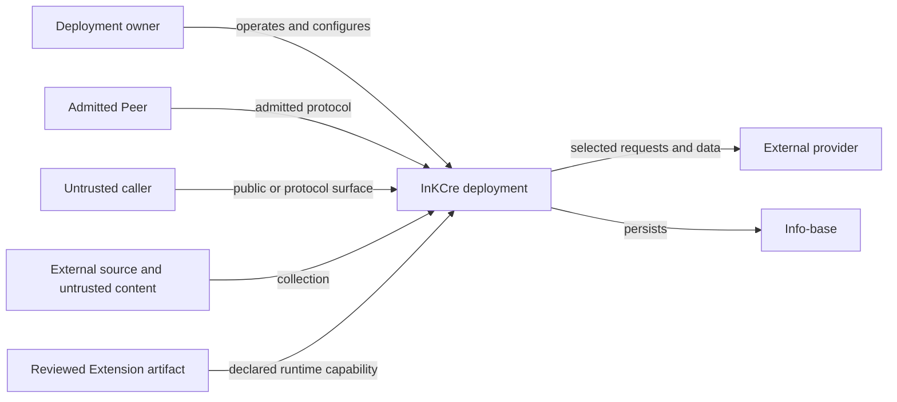

# Security Boundary Model

## Purpose

This document defines the shared security reasoning model for InKCre。It helps Humans and
implementations distinguish a vulnerability from an ordinary bug，hardening opportunity，
operational risk or accepted risk without maximizing controls for their own sake。

A security requirement needs an identified actor，protected asset，intended boundary，credible
attack path and proportionate control。Exact protocol admission，database grants，rendering，
credential handling and deployment behavior remain owned by the Unit that implements them。
External vulnerability reporting remains owned by the applicable repository `SECURITY.md` and
organization policy。

## Shared Deployment Model

The arrows are trust and authority boundaries，not a promise that every deployment exposes every
path。Host isolation，transport termination，backups and provider custody are supplied by the
selected deployment and must be assessed with its Unit-owned runtime documentation。

## Actors And Authority

| Actor | Shared posture |
| --- | --- |
| Deployment owner | Trusted administrator of one deployment。Can configure its Peers，inspect deployment-owned persistence and replace deployed artifacts。 |
| Admitted Peer | Inside the deployment trust domain after satisfying one executable Peer protocol。Peer equality does not imply identical execution capability，but the current product does not promise per-user or per-tenant isolation between admitted Peers。 |
| Untrusted caller | Has no deployment authority until admitted by the relevant public，Peer or Extension protocol。A public observation grants only its documented result。 |
| Extension protocol caller | Untrusted until the Extension-owned admission mechanism succeeds。Successful Extension admission grants only that protocol's intended authority。 |
| External source and collected content | Untrusted data。Collection does not make malformed，adversarial，stale or misleading content executable or trustworthy。 |
| Reviewed Extension artifact | Trusted application code within the runtime that admits it。An Extension registry is an organization mechanism，not a sandbox or tenant boundary。 |
| External provider | Outside the deployment boundary。It receives requests and data deliberately sent by configured capability code，subject to its own policy and credentials。 |

## Protected Assets

- confidentiality and integrity of info-base Blocks，Relations，stored bytes and derived output；
- credentials and signing material used to admit Peers，Extension callers，Sources，Storages and
  external providers；
- the deployment owner's control over collection，organization，retrieval，configuration and
  deletion；
- artifact，migration and dependency integrity；
- availability where an otherwise untrusted actor can cause meaningful denial，resource exhaustion
  or external cost。

## Shared Boundaries And Invariants

### Admission

Core，database，Peer and Extension protocols may expose different admission surfaces。Authority
granted by one surface does not silently grant another surface's authority。Public routes reveal
only their intentionally public observations。

CORS，obscurity，route naming and possession of a non-secret client identifier are not authorization
boundaries。Exact claims，roles，credentials and denial behavior belong to the implementing Unit's
executable contract。

### Persistence And Credentials

Persistence operated by the deployment is inside the deployment trust boundary unless a more
specific topology says otherwise。Persisting a credential in access-controlled deployment
configuration is not by itself a boundary violation。The relevant questions are whether an
unauthorized actor can obtain or exercise it through responses，logs，public artifacts，backups or
unrelated protocols，and whether its replacement and lifetime match the product need。

Encryption at rest，an external secret manager or non-persistence may become justified when a
deployment introduces an untrusted persistence operator，independently exposed backups，multiple
users，delegated administration，regulatory duties or another concrete boundary。They are not
automatic requirements without that boundary。

### Data And Code

Collected content，filenames，metadata，provider responses，resolver input and AI input are data
controlled partly or wholly by external parties。They must not become code，filesystem paths，SQL，
templates，privileged commands or authorization decisions without an explicit validating boundary。

Storing or interpreting adversarial content is not itself a vulnerability。Executing it，letting it
escape its intended data context or allowing it to drive privileged behavior may be one。Each
presentation Unit remains responsible for safe rendering and interaction at its own boundary。

### Extensions And Artifacts

A reviewed Extension shares the authority of the runtime or Peer that loads it unless that runtime
explicitly supplies a stronger isolation boundary。Runtime installation of unreviewed code is not
part of the current shared product contract。Artifact construction，dependency admission and release
integrity remain owned and enforced by the delivering repository。

### Privileged Operators

The deployment owner，host administrator，migration authority and anyone able to replace a running
artifact already hold high authority within their scope。Protecting a deployment from its own fully
privileged operator is not a default product goal；a deployment that separates these roles must
document the new boundary explicitly。

## Security Classification

A vulnerability requires both security harm and a credible attack path。Examples include an actor
crossing an intended boundary to：

- read，create，change or delete protected data without the authority granted by the relevant
  protocol；
- forge or bypass admission and gain materially greater authority；
- cause attacker-controlled data to execute code or privileged commands；
- expose credentials or private content through responses，logs，artifacts，caches，backups or
  providers；
- compromise artifact，migration or dependency integrity in a way that reaches users；
- cause material denial of service or external cost from an otherwise untrusted position。

A surprising behavior，best-practice deviation，missing defense-in-depth layer or hypothetical
consequence without a boundary crossing is insufficient by itself。It may still be an ordinary bug，
privacy issue，hardening opportunity，operational risk or accepted risk。

## Common Non-Boundaries

Unless another topology introduces a different actor or authority boundary，the following are not
vulnerabilities by themselves：

- a deployment owner reading or changing its own configuration，persistence，backups or process
  memory；
- one admitted Peer exercising a capability intentionally shared with admitted Peers；
- reviewed Extension code reaching resources intentionally available to its runtime；
- a credential being persisted within access-controlled deployment configuration；
- absence of encryption at rest or an extra authentication layer without a demonstrated
  unauthorized reader or caller；
- malformed or hostile collected content being stored as inert data；
- an architectural hardening proposal without an exploit path or user harm；
- behavior requiring prior host-administrator，migration-authority or artifact-replacement access。

Accurate classification does not prohibit improvement。It prevents reliability，privacy or
hardening work from borrowing false urgency from the word “vulnerability”。

## Proportionality Method

Before requiring a control or classifying a report，establish：

1. **Actor and capability**：who acts，and what authority do they already possess？
2. **Asset and harm**：what protected interest changes，leaks，executes or becomes unavailable？
3. **Boundary**：what intended separation is crossed？
4. **Attack path**：what reproducible or technically credible steps connect actor to harm？
5. **Existing controls**：which executable，deployment or operational mechanisms already reduce
   the risk？
6. **Control cost**：what dependency，obscurity，failure mode，user friction or operational burden
   would the proposed control introduce？
7. **Classification**：vulnerability，ordinary bug，hardening，operational risk or accepted risk？

Prefer the least complex control that materially changes the identified risk。Re-evaluate when an
actor，asset，deployment assumption or trust boundary changes；do not preserve a conditional answer
as a timeless rule。

## Ownership

- Shared actors，assets，boundaries and classification method：this document。
- Product authority and cross-Unit topology：[System State And Authority](system-state-and-authority.md)
  and [Unit Topology](unit-topology.md)。
- Exact admission，persistence，rendering，runtime and deployment mechanics：the implementing Unit's
  executable contract and local durable documentation。
- External vulnerability reporting：the applicable repository `SECURITY.md` and organization policy。

Update this model when a shared actor，asset，deployment assumption or trust boundary changes。Do
not duplicate Unit-local mechanics here merely because they are security-relevant。
